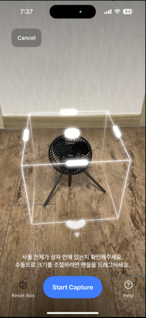
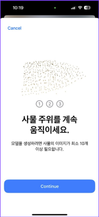
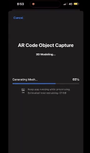
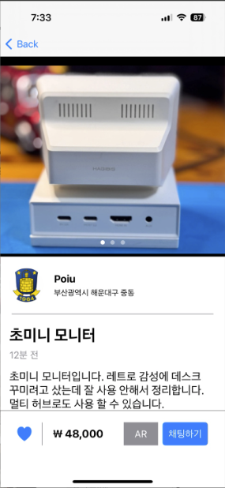
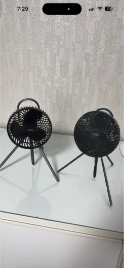
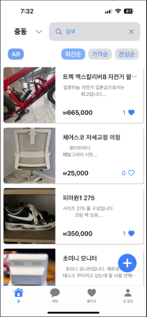
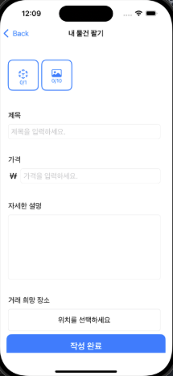
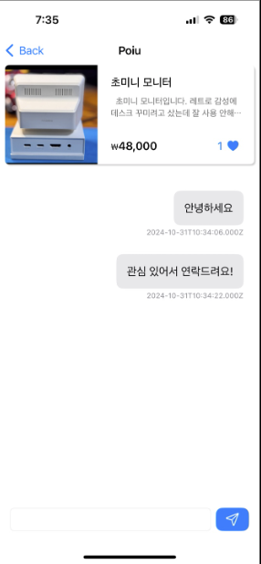

```
 █████╗ ██████╗      ███╗   ███╗ █████╗ ██████╗ ██╗  ██╗███████╗████████╗
██╔══██╗██╔══██╗     ████╗ ████║██╔══██╗██╔══██╗██║ ██╔╝██╔════╝╚══██╔══╝
███████║██████╔╝     ██╔████╔██║███████║██████╔╝█████╔╝ █████╗     ██║   
██╔══██║██╔══██╗     ██║╚██╔╝██║██╔══██║██╔══██╗██╔═██╗ ██╔══╝     ██║   
██║  ██║██║  ██║     ██║ ╚═╝ ██║██║  ██║██║  ██║██║  ██╗███████╗   ██║   
╚═╝  ╚═╝╚═╝  ╚═╝     ╚═╝     ╚═╝╚═╝  ╚═╝╚═╝  ╚═╝╚═╝  ╚═╝╚══════╝   ╚═╝  
```

<div align="center">


</div>

---

## 한 줄 소개

> **LiDAR로 상품을 3D 스캔하고, 구매자는 실제 공간에 AR로 배치해 확인하는 동네 중고거래 마켓플레이스**

---

## 배경 및 동기

중고거래에서 상품의 실제 크기·질감은 사진만으로 파악하기 어렵습니다. 특히 가구나 가전처럼 공간을 차지하는 물건은 "내 방에 실제로 맞을까?"를 구매 전에 확인할 방법이 없습니다.

Apple LiDAR 센서와 RealityKit의 `ObjectCaptureSession`을 활용해 **판매자가 상품을 직접 3D 스캔하고, 구매자가 AR로 실제 공간에 배치해 확인**하는 워크플로우를 구현했습니다. 당근마켓류의 동네 C2C 직거래 기능 위에 AR을 Native하게 통합한 것이 이 프로젝트의 핵심입니다.

---

## 기술 하이라이트

- **Apple 고수준 AR API 전략** — 저수준 `ARSession`/`ARView` 없이 `ObjectCaptureSession`(스캔) + `QLPreviewController`(뷰어)만으로 고품질 AR UX 구현. 코드 복잡도를 낮추면서 Apple이 보장하는 최적화된 렌더링 품질 확보
- **Swift Concurrency 기반 이벤트 스트리밍** — AR 세션 이벤트를 콜백 없이 `AsyncSequence`의 `for await` 루프로 구독. 상태 전환 로직이 선형적으로 읽힘
- **커스텀 `AsyncIteratorProtocol`** — `PhotogrammetrySession.outputs`가 완료 후에도 스트림을 종료하지 않는 RealityKit 동작을 `UntilProcessingCompleteFilter`로 직접 해결
- **AR ↔ 마켓플레이스 느슨한 결합** — `Post.ar_model_id (Int?)` · `ar_model_directory (String?)` 두 Optional 필드만으로 두 도메인 연결. AR 모델이 없는 일반 게시글과 완벽히 공존
- **3-Orbit 촬영 가이드 UX** — 단순 촬영 버튼이 아닌, iPhone/iPad별 MP4 튜토리얼 10개와 `OnboardingStateMachine`으로 최적 촬영 각도(수평/저각/고각)를 단계별 안내
- **`Response` enum — 다형 API 응답 처리** — API마다 다른 응답 구조(`createId`, `affectedRows`, `message` 등)를 단일 `Response` enum 하나로 파싱. `Decodable` 기반 타입 안전 패턴으로 호출부 코드가 단순해짐

---

## 주요 기능

### AR 3D 스캔 — 판매자

LiDAR로 물건을 3방향 촬영 → on-device 포토그래메트리로 USDZ 3D 모델 자동 생성

| 스캔 시작 | 3-Orbit 촬영 가이드 | 재구성 진행 |
|:---------:|:-------------------:|:-----------:|
|  |  |  |

### AR 뷰어 — 구매자

상품 상세에서 USDZ 다운로드 → AR Quick Look으로 실제 공간에 3D 모델 배치

| 상품 상세 | AR 뷰어 (실제 공간) |
|:---------:|:-------------------:|
|  |  |

### 마켓플레이스

| 상품 목록 | 게시글 등록 | 실시간 채팅 |
|:---------:|:-----------:|:-----------:|
|  |  |  |

**구현된 기능:**
- 상품 CRUD (등록 / 수정 / 비활성화) · 동네·AR 전용·정렬 필터 · 검색
- 상품 사진 다중 업로드 (PHPickerViewController → multipart/form-data)
- 관심 목록 낙관적 업데이트 · 거래 희망 장소 지도 핀 선택 (MapKit)
- 판매 내역 (거래대기 / 거래완료) · JWT 자동 로그인 + Keychain 토큰 저장
- Socket.IO 기반 1:1 실시간 채팅

---

## 기술 스택

### iOS

| 분류 | 기술 | 선택 이유 |
|------|------|----------|
| **UI** | SwiftUI | 선언형 UI + iOS 17 신규 API와의 자연스러운 통합 |
| **UIKit 브리징** | `UIViewControllerRepresentable` | PHPickerViewController, QLPreviewController 등 SwiftUI 미지원 컴포넌트 래핑 |
| **AR 스캔** | RealityKit · `ObjectCaptureSession` | LiDAR 기반 3D 캡처 — iOS 17+, LiDAR 기기 전용 |
| **AR 뷰어** | `QLPreviewController` (AR Quick Look) | 별도 ARSession 없이 바닥 감지·배치·조명·그림자를 Apple이 자동 처리 |
| **네트워킹** | URLSession (직접 구현) | Alamofire 등 외부 의존성 배제, 제네릭 메서드로 타입 안전 HTTP 클라이언트 직접 작성 |
| **실시간 채팅** | socket.io-client-swift (SPM) | Socket.IO 서버와 이벤트 기반 양방향 통신 |
| **지도** | MapKit · `MKLocalSearchCompleter` | 동네 주소 자동완성 + 거래 희망 장소 핀 선택 |
| **보안** | Keychain (`kSecClassGenericPassword`) | JWT AccessToken — UserDefaults 대비 OS 수준 암호화 저장 |
| **미디어** | AVKit · PhotosUI | AR 튜토리얼 MP4 루프 재생 / 갤러리 다중 이미지 선택 |

### 인프라 / 백엔드

| 항목 | 기술 |
|------|------|
| **서버** | AWS EC2 단일 인스턴스 |
| **API** | Node.js / Express — REST API + Socket.IO 채팅 서버 동일 포트(3000) |
| **파일 서빙** | `express.static` — 이미지 및 USDZ 파일 직접 서빙 |
| **인증** | 커스텀 JWT Bearer Token (Firebase / Cognito 미사용) |

---

## 시스템 아키텍처

**MVVM + Repository 패턴**을 채택한 이유:
- **MVVM**: View가 ViewModel의 `@Published` 속성만 구독하게 해 UI와 비즈니스 로직을 명확히 분리. SwiftUI의 선언형 렌더링과 자연스럽게 결합됨
- **Repository**: 네트워크·로컬 저장소 등 데이터 소스를 ViewModel에서 추상화. 도메인별 11개 Repository로 API 로직을 캡슐화해 각 ViewModel이 "어떻게 가져오는가"가 아닌 "무엇을 할 것인가"에만 집중

### API 응답 처리 (`Response` enum)

API마다 다른 응답 구조를 단일 `Response` enum 하나로 처리합니다. 호출부에서 타입 분기 없이 일관된 인터페이스를 사용할 수 있습니다.

```swift
enum Response: Decodable {
    case create(CreateResponse)       // createId: Int
    case createMulti(CreateMultiResponse)
    case update(UpdateResponse)       // affectedRows: Int
    case message(MessageResponse)     // message: String
}

// 호출부 — 응답 타입에 관계없이 동일한 패턴
let response: Response = try await APICall.shared.post("photo", files: files)
```

### 전체 구조

```
┌────────────────────────────────────────────────────────────────┐
│                        iOS 앱 (어웡)                             │
│                                                                │
│  SwiftUI Views  ──►  ViewModels  ──►  Repositories (×11)       │
│     (15 화면)       @Published          Post / Photo / AR       │
│                          │              User / Chat / ...      │
│                    NotificationCenter            │             │
│                    .tokenExpired 등              ▼              │
│  SocketManagerService ◄────────────► APICall.swift (Singleton) │
│  (Socket.IO Singleton)              URLSession async/await     │
└──────────────┬───────────────────────────────────┬─────────────┘
               │ Socket.IO (WebSocket)             │ HTTP REST
               ▼                                   ▼
┌──────────────────────────────────────────────────────────────┐
│               AWS EC2 — Node.js / Express (:3000)            │
│   REST API · Socket.IO 채팅 서버 · express.static 파일 서빙       │
└──────────────────────────────────────────────────────────────┘
```

> **ARCapture 서브시스템**은 MVVM 패턴을 따르지 않습니다. `AppDataModel.instance` Singleton이 `ModelState` 상태 머신을 소유하며, `ObjectCaptureSession` → `PhotogrammetrySession` 전환을 직접 제어합니다.

### 데이터 흐름

```
사용자 액션 → SwiftUI View
       │
       ▼  Task { await ... }
   ViewModel  — @Published 상태 소유
       │  try await repository.method()
       ▼
   Repository  — 도메인별 API 추상화
       │  try await APICall.shared.get/post/patch/delete<T: Decodable>()
       ▼
   URLSession.data(for:) — Bearer JWT 헤더 자동 첨부
       │
       ▼  JSONDecoder().decode(T.self, from: data)
   @Published 업데이트 → SwiftUI 자동 재렌더링

── 실시간 채팅 ──────────────────────────────────────
   socket.emit("sendMessage")  →  Socket.IO 서버
       └─ "sendMessageResponse"  →  NotificationCenter
             └─ ChatViewModel Observer  →  @Published var messages
```

**인증 흐름**: 401 응답 → `NotificationCenter.post(.tokenExpired)` → `AppState.isLoggedIn = false` → 강제 재로그인

---

## AR 기능 상세

### 두 가지 AR 워크플로우

| | **AR 스캔** | **AR 뷰어** |
|--|------------|------------|
| **사용자** | 판매자 | 구매자 |
| **목적** | 실물 상품 → USDZ 3D 모델 변환 | USDZ 모델을 실제 공간에 배치 |
| **핵심 API** | `ObjectCaptureSession` + `PhotogrammetrySession` | `QLPreviewController` (AR Quick Look) |
| **담당 모듈** | `ARCapture/` (26개 파일) | `UI/Screens/AugmentedReality/` |
| **기기 요건** | LiDAR 탑재 기기 필수 | iPhone / iPad 전 모델 |

### AR 스캔 파이프라인

```
[게시글 작성] → "모델 생성하기"
       │
       ▼  AppDataModel.startNewCapture()
  ObjectCaptureSession
  ├── Configuration { checkpointDirectory, isOverCaptureEnabled: true }
  ├── ObjectCaptureView (바운딩 박스 자동 감지 · 카메라 피드)
  ├── CaptureOverlayView (촬영 수 · 수동 셔터 · 실시간 품질 피드백)
  └── 3-Orbit 가이드 (수평 → 저각 → 고각)
        └── TutorialVideoView (iPhone/iPad별 MP4 × 10개)
       │
       ▼  session.finish()  →  objectCaptureSession = nil (GPU 해제)
  PhotogrammetrySession  (on-device 포토그래메트리)
  ├── HEIC 이미지 폴더 → .modelFile 요청
  └── for await output in UntilProcessingCompleteFilter(session.outputs)
        .requestProgress     → 진행률 UI (0% ~ 100%)
        .requestProgressInfo → 처리 단계 (preProcessing → imageAlignment
                               → pointCloudGen → meshGen → textureMapping → optimization)
        .processingComplete  → USDZ 완성
       │
       ▼  Documents/Models/3D_<UUID>.usdz 저장
  QLPreviewController — 스캔 직후 AR 미리보기
       │
       ▼  게시글 작성 화면으로 복귀 → AR 파일 업로드 → 등록
```

### Swift Concurrency 활용

`ObjectCaptureSession` 이벤트를 콜백 없이 `AsyncSequence`로 구독합니다.

```swift
// 실시간 피드백 구독
for await feedback in session.feedbackUpdates {
    updateFeedbackMessages(for: feedback)
}

// 세션 상태 전환 구독 — 자동 상태 머신 구동
for await newState in session.stateUpdates {
    onStateChanged(newState: newState)
}
```

`PhotogrammetrySession.outputs`은 완료 후에도 스트림을 종료하지 않는 문제를 커스텀 `AsyncIteratorProtocol`로 해결했습니다.

```swift
struct UntilProcessingCompleteFilter<Base: AsyncSequence>: AsyncSequence, AsyncIteratorProtocol {
    mutating func next() async -> PhotogrammetrySession.Output? {
        guard !completed else { return nil }  // processingComplete 이후 자동 종료
        guard let output = try? await iterator.next() else { return nil }
        if case .processingComplete = output { completed = true }
        return output
    }
}
```

### AR ↔ 마켓플레이스 연결

```swift
struct Post: Identifiable, Decodable {
    // 마켓플레이스 필드 ...
    var ar_model_id: Int?           // nil → AR 없는 일반 게시글
    var ar_model_directory: String? // USDZ 서버 경로
}

// PostDetail — AR 버튼 분기
if let _ = post.ar_model_id {
    NavigationLink { ArView(url: post.ar_model_directory) }
        label: { Text("AR로 보기") }
} else {
    Text("등록된 AR 모델이 없습니다.")
}
```

두 Optional 필드만으로 AR 도메인과 마켓플레이스 도메인이 느슨하게 연결되며, AR 모델 없는 일반 게시글도 완벽히 지원합니다.

---

## 설치 및 실행

### 요구 사항

| 항목 | 조건 |
|------|------|
| **Xcode** | 15.0 이상 |
| **iOS** | 17.5 이상 |
| **기기 — AR 스캔** | LiDAR 탑재 기기 (iPhone 12 Pro / iPad Pro 2020 이상) |
| **기기 — AR 뷰어** | iPhone / iPad 전 모델 |

> `ObjectCaptureSession`은 LiDAR 탑재 기기에서만 동작합니다. AR 뷰어(`QLPreviewController`)는 전 기기에서 사용 가능합니다.

### 실행

```bash
git clone https://github.com/<your-username>/ar-marketplace-ios.git
cd ar-marketplace-ios
open MVVM_Ueong.xcodeproj
```

```
Xcode 내:
1. Signing & Capabilities → Team을 개인 Apple ID로 변경
2. 실기기 선택 (시뮬레이터는 AR 기능 미지원)
3. ⌘R 실행
```

> `Constants.swift`의 `baseURL`이 현재 개발 서버를 가리킵니다. 로컬 서버가 필요하면 Node.js 백엔드 저장소를 별도로 실행하세요.

### 프로젝트 구조

```
MVVM_Ueong/
├── ARCapture/           # AR 스캔·재구성 서브시스템 (26개 파일)
│   ├── AppDataModel.swift           # Singleton + ModelState 상태 머신 (394줄)
│   ├── CaptureFolderManager.swift   # 파일시스템 관리 (294줄)
│   └── Resources/                  # 튜토리얼 MP4 × 10개 (iPhone/iPad)
├── Models/              # Codable 도메인 구조체 — Post, User, Chat, AR, Emd ...
├── Network/             # APICall.swift — 제네릭 HTTP 클라이언트 Singleton (300줄)
├── Repositories/        # 도메인별 API 추상화 11개
├── Service/             # SocketManagerService — Socket.IO + NotificationCenter 브리지
├── System/              # AppDelegate, AppState (@EnvironmentObject 전역 인증 상태)
├── UI/
│   ├── Component/       # 재사용 컴포넌트 (PostRow, SearchBar, SelectRegion ...)
│   └── Screens/         # 15개 화면 × (View + ViewModel) 쌍
└── Utils/               # KeychainHelper · TokenManager · UserDefaultsManager
docs/
└── images/              # 스크린샷
```

---

<div align="center">

**109 Swift files · ~11,040 lines · 15 screens · 11 repositories · ~30 API endpoints**

</div>
